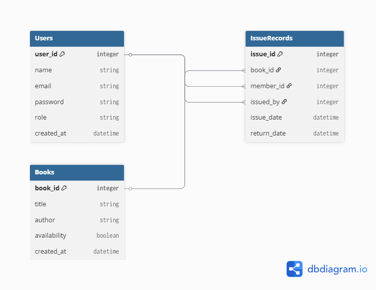

# Library Management System

A modern full-stack library management application with role-based access control, JWT authentication, and real-time book and member management.

---

## Features

### For Librarians
- Manage books (add, view, search)
- Track members and their active book issues
- Issue books to members (max 3 active books per member)
- Return books and track history
- View statistics (total books, available books, active issues)

### For Members
- Browse the complete book catalog
- View active borrowed books
- Access profile information

### General
- JWT-based authentication
- Auto-registration on first login (members only)
- Role-based dashboards (LIBRARIAN, MEMBER)
- CORS enabled for frontend integration
- Email validation and input sanitization

---

## Tech Stack

**Frontend:**
- React 18 + Vite
- TailwindCSS 3 + Lucide Icons
- Axios for API calls
- React Router DOM for navigation
- Context API for state management

**Backend:**
- Spring Boot 4.0.6 on Java 21
- Spring Security + JWT (JJWT)
- Spring Data JPA with Hibernate
- MySQL database
- SpringDoc OpenAPI (Swagger)

---

## Setup & Installation

### Prerequisites
- Node.js 16+ (for frontend)
- Java 21+ (for backend)
- MySQL 8.0+ (running in Docker or locally)

### Backend Setup

1. Navigate to backend directory:
```bash
cd backend
```

2. Build the project:
```bash
mvn clean install -DskipTests
```

3. Start the server:
```bash
mvn spring-boot:run
```

Backend runs on: `http://localhost:8080`

### Frontend Setup

1. Navigate to frontend directory:
```bash
cd frontend
```

2. Install dependencies:
```bash
npm install
```

3. Start the dev server:
```bash
npm run dev
```

Frontend runs on: `http://localhost:5173`

---

## Authentication

### Login Flow
1. Enter email and password
2. If user doesn't exist → auto-registers as MEMBER
3. Receive JWT token valid for 24 hours
4. Token stored in localStorage

### Test Credentials
- **Email**: any new email (auto-registers)
- **Password**: minimum 6 characters

---

## API Endpoints

### Authentication
```
POST /login
  Body: { email, password }
  Returns: { token, user }
```

### Books
```
GET /books                 # List all books
GET /books/available       # List available books only
GET /books/search?query=   # Search books by title/author
POST /books                # Add new book (Librarian only)
```

### Members
```
GET /members               # List all members (Librarian only)
GET /members/{id}          # Get member details
GET /members/{id}/issues   # Get member's issue history
POST /members              # Register new member
```

### Issues
```
GET /issues                # List all issues (Librarian only)
POST /issues/issue         # Issue book to member (Librarian only)
  Body: { bookId, memberId, issuedById }
PUT /issues/return/{id}    # Return issued book (Librarian only)
```

### Swagger API Docs
```
http://localhost:8080/swagger-ui.html
```

---

## Project Structure

```
Library-Management/
├── backend/
│   ├── src/main/java/com/librarymanagement/backend/
│   │   ├── auth/           # Login, JWT tokens
│   │   ├── config/         # Security, CORS, JWT config
│   │   ├── controller/     # REST endpoints
│   │   ├── service/        # Business logic
│   │   ├── repository/     # Database queries
│   │   ├── entity/         # JPA entities
│   │   ├── dto/            # Data transfer objects
│   │   └── enums/          # Role enum
│   └── pom.xml
├── frontend/
│   ├── src/
│   │   ├── api/            # Axios instance + endpoints
│   │   ├── pages/          # React pages
│   │   ├── components/     # Reusable UI components
│   │   ├── context/        # Auth & Toast contexts
│   │   ├── hooks/          # Custom React hooks
│   │   ├── routes/         # Route definitions
│   │   └── services/       # Service wrappers
│   └── package.json
└── README.md
```

---

## Database Schema



**Tables:**
- `users` - Stores all users (Librarian/Member)
- `books` - Book catalog with availability status
- `issue_records` - Tracks book issuance and returns

---

## How to Use

### As a Librarian
1. Login with any email (first-time auto-registers, but you can manually create a librarian)
2. Go to Books → Add new books
3. Go to Issues → Issue books to members
4. Track active books and returns

### As a Member
1. Login with your email (auto-registers as member)
2. Browse book catalog
3. View borrowed books on your dashboard

---

## Security Features

- JWT token-based authentication
- BCrypt password hashing
- CORS restricted to frontend origin
- Input validation with regex patterns
- Stateless session management
- Role-based access control

---
